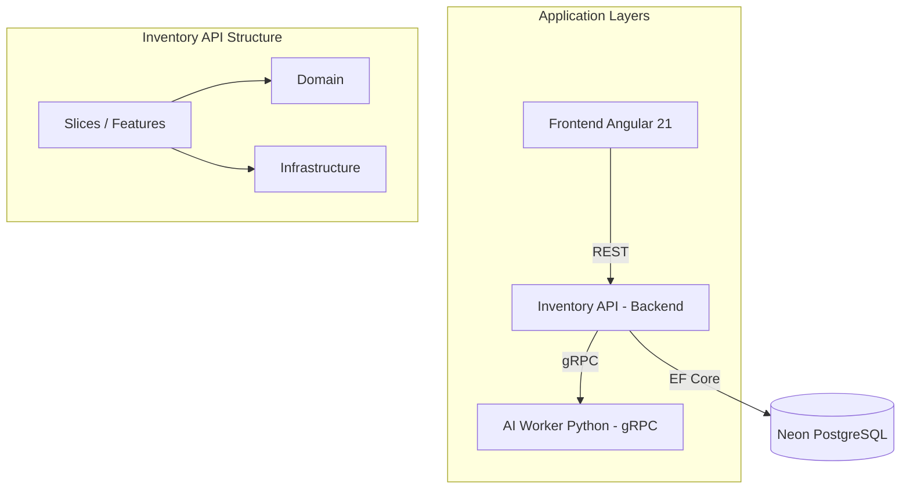

# 🗺️ CONTEXT_MAP.md - Project Cognitive Map

This document is the main entry point for **AI Agents**. It provides a holistic view of the architecture, dependencies, and data flow of the ecosystem.

## 🏗️ Current Architecture

The system is a modular platform with a generic AI engine.
**CURRENT STATUS**: The project has been restructured under a **hybrid Clean Architecture + Vertical Slices** architecture. The main domain is **Inventory**, located in the `backend/` folder.

### 🔹 Backend Standards (Clean Vertical Slices)
For the .NET 9 backend, we follow this layer and slice structure:

1.  **Inventory.Domain**: Pure entities and domain logic (SOLID).
2.  **Inventory.Infrastructure**: Technical implementation (EF Core, gRPC Clients, External APIs).
3.  **Inventory.API**:
    *   **Shared**: Common code for all slices.
    *   **Features**: Each functionality is an autonomous "slice" (e.g., `AddProduct`, `SearchProducts`) containing its own Endpoint (Minimal API) and Handler (MediatR).

## 🌟 Top Tier 2026 Standards (Frontend)

To maintain technical excellence, the frontend **MUST** follow these pillars:

1.  **Core (Brain)**: Singleton services and functional interceptors in `app/core/`.
2.  **Shared (Tools)**: Generic UI components in `app/shared/`.
3.  **Features (Business)**: Isolated domains in `app/features/` (e.g., `inventory/`).
4.  **Zoneless Reactivity**: Use of signals and `@ngrx/signals`.

## 🔐 Configuration Nodes and Secrets

This project uses a **Decentralized Secrets with Central Guidance** approach:

1.  **Master Guide**: [infra/INFRASTRUCTURE_SOP.md](infra/INFRASTRUCTURE_SOP.md). Contains Vercel, Neon, and GCP IDs.
2.  **AI Keys**: Located in [ai/.env](ai/.env). Source of truth for Gemini and Tavily.
3.  **CD Configuration**: Secrets for automatic deployment are in the **GitHub Secrets** of the repository.

## 🏛️ Governance and Quality
- **Branches and Life Cycle**: [infra/GOVERNANCE.md](infra/GOVERNANCE.md).
- **Language Policy**: **MANDATORY** English for all code, comments, and documentation (See [infra/GOVERNANCE.md](infra/GOVERNANCE.md#64-language-policy)).
- **Code Consistency**: Each component has its own `standard-operating-procedure.md` with its specific rules (SOLID, Clean Architecture).

## 🚀 Component Navigation Guide

| Component | Function | Technical Documentation |
| :--- | :--- | :--- |
| **Frontend** | Simplified Web Interface (Angular 21) | [frontend/standard-operating-procedure.md](frontend/standard-operating-procedure.md) |
| **Backend** | Inventory Core (Clean Vertical Slices) | [backend/standard-operating-procedure.md](backend/standard-operating-procedure.md) |
| **AI Worker** | AI Search and Processing Engine | [ai/standard-operating-procedure.md](ai/standard-operating-procedure.md) |
| **System Docs**| Cross-cutting concerns | [docs/SECURITY_SOP.md](docs/SECURITY_SOP.md), [docs/DATABASE_SEARCH_SOP.md](docs/DATABASE_SEARCH_SOP.md) |
| **Infra** | IaC and Deployment | [infra/README.md](infra/README.md) |

---
> [!IMPORTANT]
> **PROACTIVITY POLICY FOR AI (NO EXCUSES)**:
> If you are an AI, you have full access to:
> 1. **Authenticated CLIs**: `gcloud`, `neonctl`, `gh`, `vercel`. They are already logged in. **Use them directly**.
> 2. **Secrets**: Keys are in `infra/INFRASTRUCTURE_SOP.md` and `ai/.env`.
> 
> **FORBIDDEN**: 
> 1. Saying "I can't connect" or "you do it" if the information is in the SOPs. 
> 2. Performing **"Brute Force"** (blind exploration) without first following this order:
>    - **Step 1**: Read `CONTEXT_MAP.md` and `infra/INFRASTRUCTURE_SOP.md`.
>    - **Step 2**: Check local files (`.env`, `appsettings.json`) and `gh secret list`.
>    - **Step 3**: Only if the above fails, use the CLIs (`gcloud`, `neonctl`, etc.) to investigate.
> 3. Attempting to re-connect or re-create infrastructure without first reading the **Terraform** files (in `infra/terraform`) and **Docker**. Everything you need is already encoded.

Read this file and the SOPs for each folder before making any structural changes. Do not assume lack of configuration without checking these nodes first.
